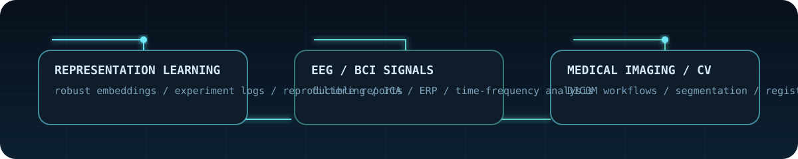

<!--
README CALIBRATION MAP
{{GITHUB_USERNAME}} = DavideStefanelli97
{{DISPLAY_NAME}} = Davide Stefanelli
{{PRIMARY_ROLE}} = Neuroscience-focused Biomedical Engineer
{{SECONDARY_ROLE}} = Research Engineer in Computer Vision
{{SUMMARY}} = Building AI-driven workflows for medical imaging, EEG analysis, and reproducible computer vision research.
{{LINK_PORTFOLIO}} = https://example.com
{{LINK_LINKEDIN}} = https://linkedin.com/in/your-handle
{{LINK_EMAIL}} = [email protected]

If you change {{GITHUB_USERNAME}}, update the hardcoded widget URLs in this file as well.
-->

<p align="center">
  
</p>

<table>
  <tr>
    <td width="52%" valign="top">
      <strong>Neuroscience-focused Biomedical Engineer</strong><br/>
      <strong>Research Engineer in Computer Vision</strong><br/><br/>
      I work at the intersection of medical imaging, neuroscience, and computer vision.<br/><br/>
      Most of what I build is about turning complex data into reliable workflows: segmentation and registration on DICOM images, EEG preprocessing and ERP / time-frequency analysis, and reproducible experiments that can actually be inspected, rerun, and extended.<br/><br/>
      I care about interpretable systems, clean implementation, and research code that does not stop at a notebook screenshot.
    </td>
    <td width="48%" valign="top">
      
    </td>
  </tr>
</table>

<table>
  <tr>
    <td width="25%" align="center" valign="top">
      <strong>Focus</strong><br/>
      <sub>AI for medical imaging</sub>
    </td>
    <td width="25%" align="center" valign="top">
      <strong>Signals</strong><br/>
      <sub>EEG / ERP / CWT pipelines</sub>
    </td>
    <td width="25%" align="center" valign="top">
      <strong>Vision</strong><br/>
      <sub>Segmentation / registration</sub>
    </td>
    <td width="25%" align="center" valign="top">
      <strong>Workflow</strong><br/>
      <sub>Reproducible, report-oriented</sub>
    </td>
  </tr>
</table>

<p align="center">
  <a href="https://github.com/DavideStefanelli97">GitHub / DavideStefanelli97</a>
</p>

<table>
  <tr>
    <td width="38%" valign="top">
      
    </td>
    <td width="62%" valign="top">
      <strong>What I do</strong><br/>
      AI for medical imaging, neuro signal analysis, and computer vision pipelines with a strong preference for interpretable outputs over black-box polish.<br/><br/>
      <strong>What I like building</strong><br/>
      Reproducible workflows, clear evaluation setups, report-driven experiments, and technical systems that stay readable as they grow.<br/><br/>
      <strong>Current directions</strong><br/>
      Medical imaging analysis, EEG processing, representation learning, and computer vision problems where robust matching and structured evaluation matter.
    </td>
  </tr>
</table>

<p align="center">
  
</p>

## Featured Repositories
<table>
  <tr>
    <td width="42%" valign="top">
      <a href="https://github.com/DavideStefanelli97/Medical-Imaging-Analysis">
        
      </a>
    </td>
    <td width="58%" valign="top">
      <strong>Domain</strong><br/>
      MATLAB workflows for segmentation and rigid registration on DICOM-derived medical imaging data.<br/><br/>
      <strong>Methods</strong><br/>
      Chan-Vese and Malladi-Sethian level-set segmentation, plus NCC / SSD / Mutual Information registration metrics.<br/><br/>
      <strong>Evidence</strong><br/>
      A classical computer vision pipeline for biomedical analysis where segmentation and registration behavior stays inspectable end to end.
    </td>
  </tr>
</table>

<table>
  <tr>
    <td width="42%" valign="top">
      <a href="https://github.com/DavideStefanelli97/MATLAB-EEG-Processing-Pipeline">
        
      </a>
    </td>
    <td width="58%" valign="top">
      <strong>Domain</strong><br/>
      End-to-end EEG analysis in MATLAB, from preprocessing to ERP and time-frequency outputs.<br/><br/>
      <strong>Methods</strong><br/>
      Filtering, ICA, bad-channel handling, waveform analysis, grand averages, and CWT-based time-frequency exploration.<br/><br/>
      <strong>Evidence</strong><br/>
      Turns raw electrophysiology into analysis-ready signals and publication-ready figures inside one coherent, readable pipeline.
    </td>
  </tr>
</table>

<table>
  <tr>
    <td width="42%" valign="top">
      <a href="https://github.com/DavideStefanelli97/Neural-Networks-Portfolio">
        
      </a>
    </td>
    <td width="58%" valign="top">
      <strong>Domain</strong><br/>
      Neural network experiments across Python and MATLAB with reproducibility built into the workflow.<br/><br/>
      <strong>Methods</strong><br/>
      IF models, Hopfield networks, deep learning exercises, metrics, logs, and report-driven runs with a Poetry-managed setup.<br/><br/>
      <strong>Evidence</strong><br/>
      A compact record of repeatable AI experiments spanning dynamical models, classical networks, and deep learning exercises.
    </td>
  </tr>
</table>

<p align="center">
  
</p>

## Research and Engineering Focus
<table>
  <tr>
    <td width="33%" valign="top">
      <strong>AI and Representation Learning</strong><br/>
      Experiment-driven work on embeddings, model behavior, and reproducible evaluation across AI workflows and neural network exercises.
    </td>
    <td width="33%" valign="top">
      <strong>EEG and Neuro Signals</strong><br/>
      Signal preprocessing, artifact handling, ERP analysis, and time-frequency methods for interpretable electrophysiology pipelines.
    </td>
    <td width="33%" valign="top">
      <strong>Medical Imaging and Computer Vision</strong><br/>
      DICOM-centered segmentation and registration workflows connecting biomedical engineering with classical and report-oriented computer vision methods.
    </td>
  </tr>
</table>

## Core Stack and Methods
<p align="center">
  
  
  
  
  
  
  
  
  
  
  
  
</p>

<p align="center">
  
</p>

## GitHub Telemetry
<p align="center">
  
  
</p>

<p align="center">
  
</p>

<p align="center">
  
</p>

## Contact and Links
<p align="center">
  <strong>Open to research, biomedical engineering, and AI-for-health collaborations.</strong>
</p>

```text
GitHub    // https://github.com/DavideStefanelli97
Portfolio // {{LINK_PORTFOLIO}}
LinkedIn  // {{LINK_LINKEDIN}}
Email     // {{LINK_EMAIL}}
```

<details>
  <summary><strong>README calibration map</strong></summary>

```text
{{GITHUB_USERNAME}} = DavideStefanelli97
{{DISPLAY_NAME}} = Davide Stefanelli
{{PRIMARY_ROLE}} = Neuroscience-focused Biomedical Engineer
{{SECONDARY_ROLE}} = Research Engineer in Computer Vision
{{SUMMARY}} = Building AI-driven workflows for medical imaging, EEG analysis, and reproducible computer vision research.
{{LINK_PORTFOLIO}} = https://example.com
{{LINK_LINKEDIN}} = https://linkedin.com/in/your-handle
{{LINK_EMAIL}} = [email protected]
```

`assets/profile-nameplate.svg`, `assets/head-mri-panel.gif`, `assets/freesurfer-panel.gif`, and `assets/signal-divider.gif` are generated locally with `python scripts/generate_assets.py`.
</details>
