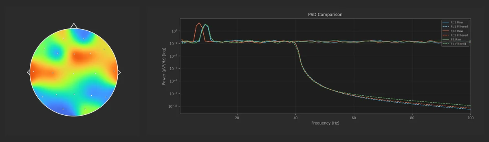
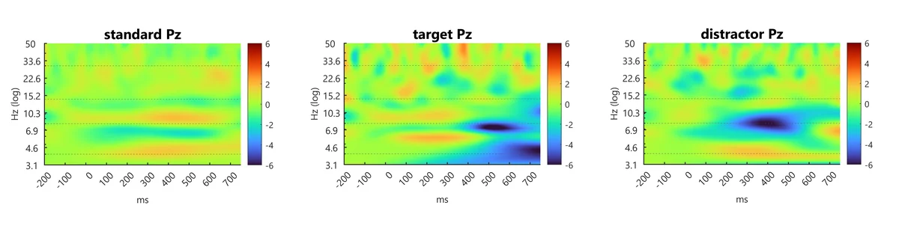
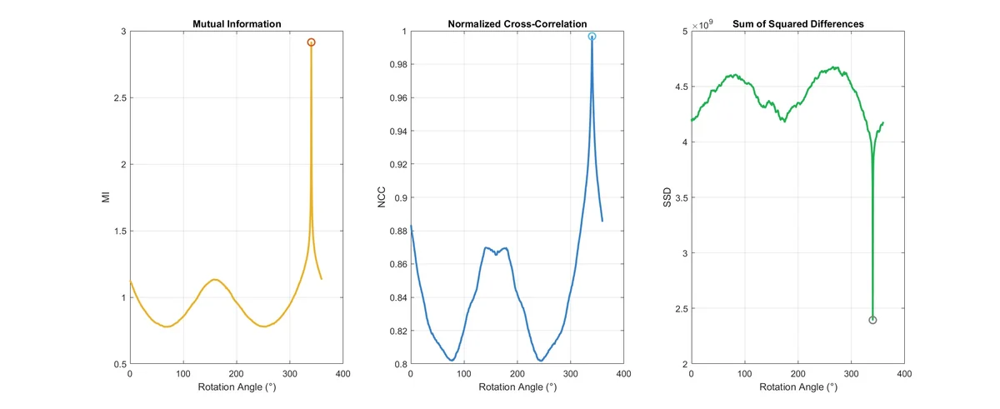

# Davide Stefanelli

### Research engineering across visual and neural data

**Computer Vision / ML Research Engineer** · M.Sc. candidate in **Biomedical Engineering for Neuroscience**, University of Bologna.

[Selected work](#selected-work) · [Research direction](#research-direction) · [LinkedIn](https://www.linkedin.com/in/davide-stefanelli-engineer) · [Email](mailto:davide.stefanelli.ing@gmail.com)

I build and evaluate visual re-identification and retrieval systems, from data curation to reproducible experiments and failure analysis. My EEG and medical-imaging work applies the same discipline: explicit evaluation, inspectable outputs and scientific software.

**Visual retrieval** / **Neural representations** / **Biomedical signals** / **Scientific software**

## Selected work

### 01 / EEG brain fingerprinting with metric learning

**Research snapshot · public code release in preparation**

Can an EEG representation identify a person unseen during training? I built an open-set identification workflow on [PhysioNet EEGMMIDB](https://physionet.org/content/eegmmidb/1.0.0/): 64-channel, two-second windows, CNN / EEGNet encoders and 128-dimensional normalised embeddings. Subject- and run-aware splits connect metric-learning training to verification and query–gallery evaluation.

**Documented local evaluation:** 12 held-out subjects, 9,553 test segments. **Rank-1 86.4% · Rank-5 97.2% · verification AUC 0.919.** The implementation is not yet publicly inspectable.

### 02 / NEURO-SCOPE

**An interactive workbench for exploring EEG in space and time.**

Built a Python application with linked 3D scalp, topographic, spectral and waveform views: precomputed RBF interpolation, non-destructive filters, montage editing and saved sessions. Implemented with **PyQt6, PyVista / VTK and MNE**.

**Inspect:** six format families, a synthetic demo, backend tests and Windows build instructions.

[Code & demo](https://github.com/DavideStefanelli97/NEURO-SCOPE) · [Interface tour](https://github.com/DavideStefanelli97/NEURO-SCOPE/blob/main/docs/INTERFACE_TOUR.md) · [Tests](https://github.com/DavideStefanelli97/NEURO-SCOPE/tree/main/tests)

### 03 / MATLAB EEG Processing Pipeline

**From raw recordings to traceable ERP and time–frequency results.**

Built four connected stages—preprocessing, ICA review, ERP / P300 and Morlet-wavelet analysis—with JSON configuration, versioned ICA decisions and `.mat` contracts. Subject diagnostics and group reports make processing decisions traceable through to the outputs.

**Inspect:** dozens of diagnostic figures, scientific reports and plotting / regression checks. Full runs require the documented external data and MATLAB toolboxes.

[Code & workflow](https://github.com/DavideStefanelli97/MATLAB-EEG-Processing-Pipeline) · [Scientific reports](https://github.com/DavideStefanelli97/MATLAB-EEG-Processing-Pipeline/tree/main/reports) · [Data requirements](https://github.com/DavideStefanelli97/MATLAB-EEG-Processing-Pipeline/blob/main/docs/data_manifest.md)

### 04 / Medical Imaging Analysis

**Classical vision methods with numerical and visual diagnostics.**

Implemented DICOM-centred segmentation and rigid registration in MATLAB: Chan–Vese / Malladi–Sethian level sets, finite-difference solvers and NCC / SSD / mutual-information objectives. Reports expose numerical methods, metric curves and contributions.

**Synthetic-rotation case:** 720 candidate angles; NCC **0.8834 → 0.9967**, mutual information **1.1180 → 2.9144**. Case-study registration metrics, not clinical validation or a segmentation benchmark.

[Code & methods](https://github.com/DavideStefanelli97/Medical-Imaging-Analysis) · [Rotation report](https://github.com/DavideStefanelli97/Medical-Imaging-Analysis/blob/master/results/reg_rotation/REPORT.md) · [Contribution map](https://github.com/DavideStefanelli97/Medical-Imaging-Analysis/blob/master/CONTRIBUTIONS.md)

## Research direction

How can a representation remain useful across subjects, acquisition conditions and tasks? My direction is neural representation learning, building on the evaluation discipline of visual retrieval.

Professionally, I own the ReID experiment loop: data curation, PyTorch training, evaluation and failure analysis. Production work is private; this portfolio contains no internal datasets, benchmarks or implementation details.

Open to **PhD research in Europe and international collaborations** in neural representation learning, biomedical signal processing, NeuroAI and reproducible scientific ML, and aligned research-engineering roles.

## Methods & tools

- **Learn & retrieve:** Python, PyTorch · representation and metric learning · embedding retrieval · verification and query–gallery evaluation.
- **Process & measure:** MATLAB, MNE, SciPy · EEG / ERP / time–frequency analysis · DICOM · segmentation and registration.
- **Build & reproduce:** PyQt6, PyVista / VTK · configuration-driven pipelines · Git, Poetry, pytest · scientific reporting.

Further work: neural dynamics and associative memory

The public [Neural Networks Portfolio](https://github.com/DavideStefanelli97/Neural-Networks-Portfolio) contains nine exercises across four chapters: integrate-and-fire models, Jansen–Rit neural masses, Hebbian learning and Hopfield networks. It connects model implementation with repeatable runs, diagnostics and reports.

## Get in touch

For a research conversation, collaboration or a role at the intersection of visual and neural data:

[**davide.stefanelli.ing@gmail.com**](mailto:davide.stefanelli.ing@gmail.com) · [LinkedIn](https://www.linkedin.com/in/davide-stefanelli-engineer) · [GitHub](https://github.com/DavideStefanelli97)

---

Original schematic hero; project-derived previews. Motion plays once and respects reduced-motion preferences. [Asset provenance & regeneration](assets/ASSET_GUIDE.md).
