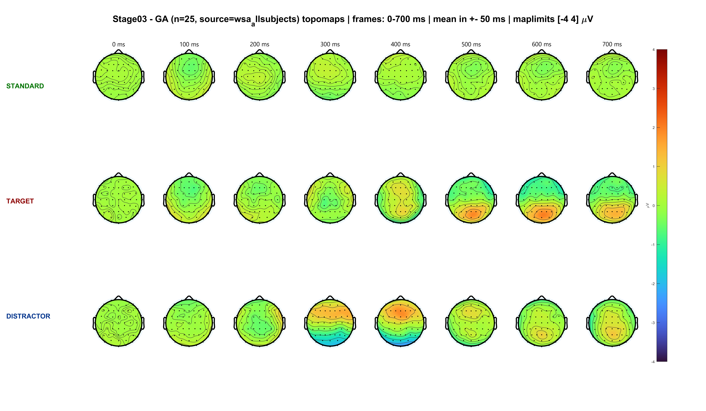
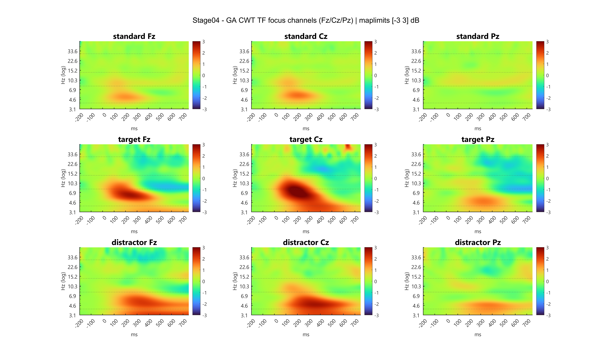
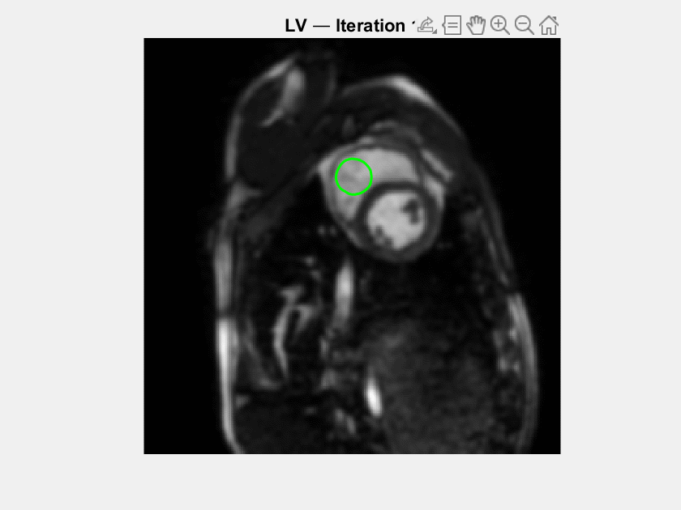
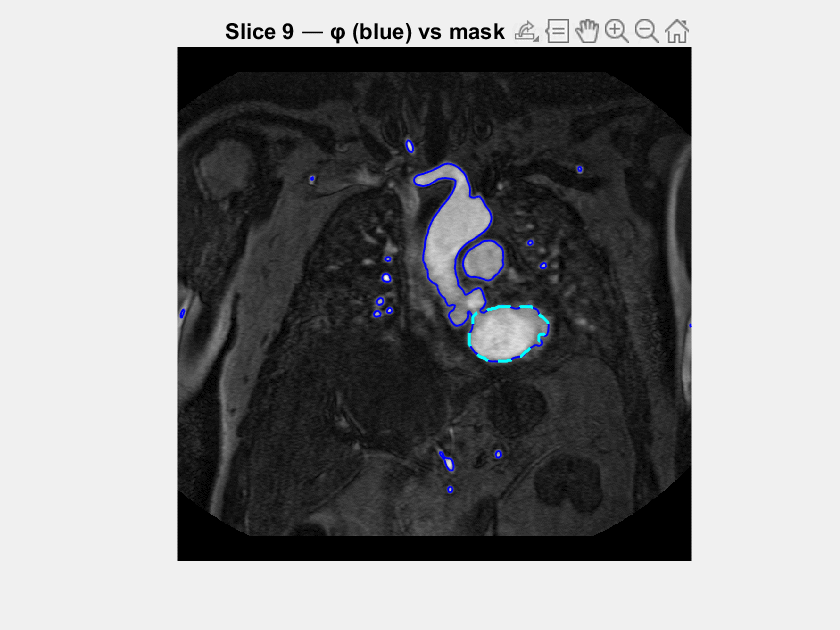

  

  <strong>Computer Vision / ML Research Engineer · Biomedical Engineer</strong> 
  Cesena, Italy · M.Sc. candidate, University of Bologna

  <a href="https://www.linkedin.com/in/davide-stefanelli-engineer/">LinkedIn</a> &nbsp; / &nbsp;
  <a href="mailto:davide.stefanelli.ing@gmail.com">Email</a> &nbsp; / &nbsp;
  <a href="#selected-projects">Explore my work ↓</a>

I build systems that turn images and neural signals into useful representations: **visual identity retrieval, EEG analysis, and medical-image processing**. My work connects model development with the tools needed to understand it—dataset curation, evaluation, failure analysis, and scientific visualization.

At **Vivilo** (formerly Jubatus), I develop visual re-identification and retrieval workflows for motorsport media, from dataset construction and PyTorch training to query–gallery evaluation and embedding post-processing.

Alongside this, I am completing an **M.Sc. in Biomedical Engineering for Neuroscience** at the University of Bologna, with graduation expected in **March 2027**. I am interested in how representation learning can generalize across subjects and make neural and biomedical data easier to interpret.

  

## Selected projects

### [EEG Processing Pipeline ↗](https://github.com/DavideStefanelli97/MATLAB-EEG-Processing-Pipeline)

**From raw recordings to the dynamics of attention.**

A four-stage MATLAB / EEGLAB workflow for a three-stimulus oddball task: filtering and channel quality control, ICA artifact removal, ERP / P300 analysis, and Morlet time–frequency decomposition. Configuration files and diagnostic reports make each processing step inspectable.

MATLAB · EEGLAB · ICA · ERP / P300 · Morlet CWT

  
   
  <strong>EEG across space and time.</strong> Grand-average scalp potentials · 25 subjects · Standard, target and distractor stimuli.

  
Explore the time–frequency view

   
  

    
     
    Morlet CWT at Fz, Cz and Pz · Baseline-relative power in dB.
  

[Explore the pipeline →](https://github.com/DavideStefanelli97/MATLAB-EEG-Processing-Pipeline)

 

### [Medical Imaging Analysis ↗](https://github.com/DavideStefanelli97/Medical-Imaging-Analysis)

**From image intensities to anatomical boundaries.**

Level-set segmentation with Chan–Vese and Malladi–Sethian methods, from kidney and cardiac contours to a slice-by-slice left atrium reconstruction. Complementary rigid-registration workflows align medical images using NCC, SSD and mutual information, with visual reports to inspect the results.

MATLAB · DICOM · Level sets · 3D reconstruction · Image registration

  
  
   
  <strong>Contours in motion.</strong> Left: left-ventricle contour evolution. Right: left atrium segmentation across MRI slices.

[Explore the imaging workflows →](https://github.com/DavideStefanelli97/Medical-Imaging-Analysis)

  

## From brain signals to intelligent systems

My biomedical projects span electrophysiology, anatomical imaging, and neural modeling. My next research questions center on **EEG representation learning, cross-subject generalization, and brain-inspired learning**.

I have also built an **open-set EEG identification study** using compact neural encoders and metric learning on PhysioNet EEGMMIDB, with subject-separated training and evaluation. The work connects my experience in visual retrieval with neural data; its public code release is in preparation.

  
  
   
  Structural imaging and cortical anatomy · Illustrative source animations, not project outputs · <a href="./assets/ASSET_GUIDE.md#provenance">Credits</a>

## Tools & approach

| Area | What I use |
| :--- | :--- |
| **ML & retrieval** | Python, PyTorch, metric learning, visual re-identification, mAP / CMC evaluation |
| **Signals & imaging** | MATLAB, EEGLAB, MNE-Python, NumPy, SciPy, DICOM |
| **Scientific software** | PyQt6, PyVista / VTK, Matplotlib, configuration-driven pipelines |
| **Engineering** | Git, Poetry, pytest, Ruff, documented experiments and diagnostic reports |

I care about clear evaluation protocols, inspectable failures, and experiments that can be rerun from configuration.

---

**Let's build something worth investigating.** 
Open to **Research Engineer / AI / Computer Vision roles**, research collaborations, and **PhD opportunities in Europe** at the intersection of machine learning, neuroscience, and biomedical engineering.

[Get in touch by email](mailto:davide.stefanelli.ing@gmail.com) · [Connect on LinkedIn](https://www.linkedin.com/in/davide-stefanelli-engineer/)
