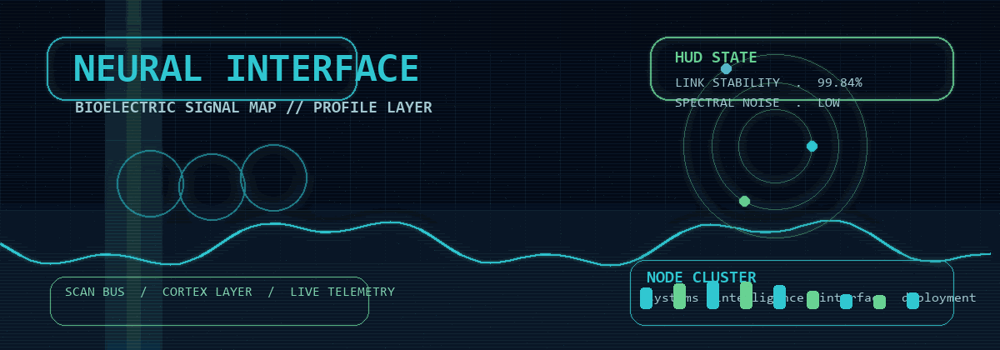
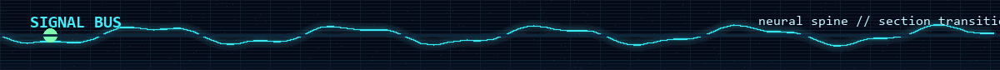
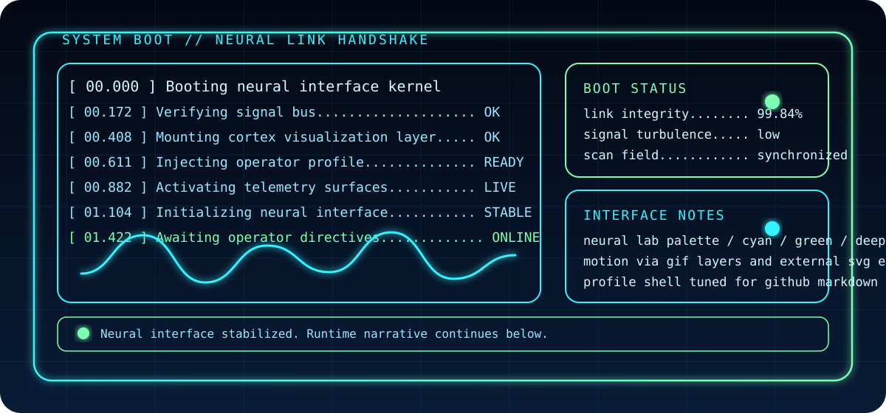
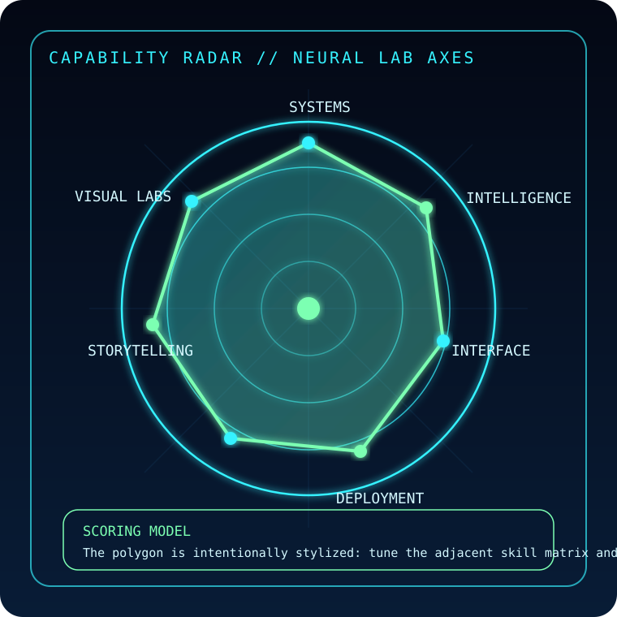
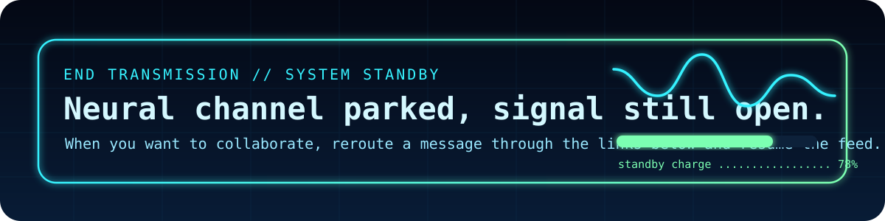

<!--
NEURAL PROFILE CALIBRATION MAP
{{GITHUB_USERNAME}}   = DavideStefanelli97
{{DISPLAY_NAME}}      = Davide Stefanelli
{{PRIMARY_TAGLINE}}   = Neural Systems Architect
{{SECONDARY_TAGLINE}} = Creative Developer / AI Interface Builder
{{SHORT_BIO}}         = Building cinematic product interfaces, intelligent workflows, and high-signal developer systems.
{{LOCATION}}          = Cesena, Italy
{{FOCUS_1}}           = Generative interfaces
{{FOCUS_2}}           = AI workflow design
{{FOCUS_3}}           = Visual telemetry systems
{{LINK_PORTFOLIO}}    = https://example.com
{{LINK_LINKEDIN}}     = https://linkedin.com/in/your-handle
{{LINK_EMAIL}}        = [email protected]

Search for "CALIBRATION MAP" and "replace" comments to tune the profile.
Also replace the hardcoded username in external widget URLs when you change {{GITHUB_USERNAME}}.
-->

<p align="center">
  
</p>

<p align="center">
  
</p>

<p align="center">
  
  
  
  
</p>

<p align="center">
  <a href="https://github.com/DavideStefanelli97">
    
  </a>
  
  
  
</p>

<p align="center">
  
</p>

<p align="center">
  
</p>

```text
[ BOOT // INTRO ]
[00.000] initializing neural interface.................... online
[00.172] synchronizing signal bus......................... stable
[00.408] loading operator shell........................... complete
[00.611] mapping cortex-grade visualization layers....... complete
[00.882] calibrating telemetry surfaces.................. complete
[01.104] opening public profile channel.................. live

operator:// Davide Stefanelli
location:// Cesena, Italy
bio.....:// Building cinematic product interfaces, intelligent workflows,
            and high-signal developer systems.
focus...:// Generative interfaces / AI workflow design / Visual telemetry systems
```

<p align="center">
  
</p>

<table>
  <tr>
    <td width="50%" valign="top">
      
    </td>
    <td width="50%" valign="top">
      <pre>
CORE SKILLS MATRIX

SYSTEM DESIGN ............ ████████████ 96
GENERATIVE UI ............ ███████████░ 92
AI WORKFLOWS ............. ██████████░░ 88
DATA STORYTELLING ........ ██████████░░ 87
VISUAL SYSTEMS ........... ███████████░ 91
DEPLOYMENT FLOW .......... ████████░░░░ 74

Replace this matrix with your own strengths if you want
the radar and copy to align more tightly with your real profile.
      </pre>
    </td>
  </tr>
  <tr>
    <td width="50%" valign="top">
      <p align="center"><strong>SYSTEMS</strong></p>
      <!-- replace badge groups below with your real stack -->
      <p align="center">
        
        
        
        
      </p>
      <p align="center"><strong>INTELLIGENCE</strong></p>
      <p align="center">
        
        
        
        
      </p>
      <p align="center"><strong>INTERFACE</strong></p>
      <p align="center">
        
        
        
        
      </p>
      <p align="center"><strong>DEPLOYMENT</strong></p>
      <p align="center">
        
        
        
        
      </p>
    </td>
    <td width="50%" valign="top">
      <pre>
CURRENT DIRECTIVES

01 :: Generative interfaces
02 :: AI workflow design
03 :: Visual telemetry systems

ACTIVE EXPERIMENTS

> converting plain product surfaces into cinematic system interfaces
> designing developer tooling with clearer signal / lower friction
> building AI-assisted flows that feel precise instead of noisy

Replace the three directives above with {{FOCUS_1}}, {{FOCUS_2}},
and {{FOCUS_3}} once you decide on your final profile language.
      </pre>
    </td>
  </tr>
</table>

<p align="center">
  
</p>

<p align="center">
  
  
</p>

<p align="center">
  
</p>

<p align="center">
  
</p>

```text
[ SIGNAL / ACTIVITY STREAM ]
[feed] repo pulse packets are mirrored below as telemetry rather than prose
[feed] contribution density becomes waveform
[feed] streak persistence is treated as system uptime
[feed] language distribution is rendered as code spectrum
[feed] future upgrade path: optional GitHub Action can publish richer terminal logs
```

<p align="center">
  
</p>

<p align="center">
  
</p>

<p align="center">
  
</p>

<p align="center">
  <strong>Transmission complete.</strong><br/>
  The channel stays warm for collaborations, experiments, and strange high-signal ideas.
</p>

<p align="center">
  <a href="https://github.com/DavideStefanelli97">
    
  </a>
  
  
</p>

<details>
  <summary><strong>CALIBRATION MAP // EDIT THESE PLACEHOLDERS</strong></summary>

```text
{{GITHUB_USERNAME}}   = DavideStefanelli97
{{DISPLAY_NAME}}      = Davide Stefanelli
{{PRIMARY_TAGLINE}}   = Neural Systems Architect
{{SECONDARY_TAGLINE}} = Creative Developer / AI Interface Builder
{{SHORT_BIO}}         = Building cinematic product interfaces, intelligent workflows, and high-signal developer systems.
{{LOCATION}}          = Cesena, Italy
{{FOCUS_1}}           = Generative interfaces
{{FOCUS_2}}           = AI workflow design
{{FOCUS_3}}           = Visual telemetry systems
{{LINK_PORTFOLIO}}    = https://example.com
{{LINK_LINKEDIN}}     = https://linkedin.com/in/your-handle
{{LINK_EMAIL}}        = [email protected]
```

`hero-neural.gif` and `divider-signal.gif` are locally generated with `python scripts/generate_assets.py`.
</details>
