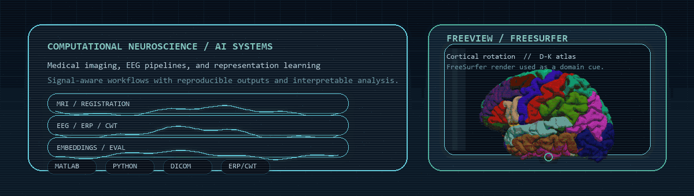

<!--
README CALIBRATION MAP
{{GITHUB_USERNAME}} = DavideStefanelli97
{{DISPLAY_NAME}} = Davide Stefanelli
{{PRIMARY_ROLE}} = Neuroscience-focused Biomedical Engineer
{{SECONDARY_ROLE}} = Research Engineer in Computer Vision
{{SUMMARY}} = Building reproducible AI workflows for medical imaging, EEG analysis, and robust representation learning.
{{LINK_PORTFOLIO}} = https://example.com
{{LINK_LINKEDIN}} = https://linkedin.com/in/your-handle
{{LINK_EMAIL}} = [email protected]

If you change {{GITHUB_USERNAME}}, update the hardcoded widget URLs in this file as well.
-->

<p align="center">
  
</p>

<h1 align="center">Davide Stefanelli</h1>

<p align="center">
  <strong>Neuroscience-focused Biomedical Engineer</strong> ·
  <strong>Research Engineer in Computer Vision</strong>
</p>

<p align="center">
  Building reproducible AI workflows for medical imaging, EEG analysis, and robust representation learning.
</p>

<p align="center">
  
  
  
  
  
</p>

<p align="center">
  <a href="https://github.com/DavideStefanelli97">
    
  </a>
</p>

<p align="center">
  
</p>

## Featured Repositories
<table>
  <tr>
    <td width="42%" valign="top">
      <a href="https://github.com/DavideStefanelli97/Medical-Imaging-Analysis">
        
      </a>
    </td>
    <td width="58%" valign="top">
      <strong>Domain</strong><br/>
      Smart medical imaging workflows in MATLAB for segmentation and rigid registration on DICOM-based data.<br/><br/>
      <strong>Methods</strong><br/>
      Chan-Vese and Malladi-Sethian level-set segmentation, plus NCC / SSD / Mutual Information registration metrics.<br/><br/>
      <strong>Evidence</strong><br/>
      A focused classical computer vision stack for medical image analysis, designed to make segmentation and registration behavior explicit rather than opaque.
    </td>
  </tr>
</table>

<table>
  <tr>
    <td width="42%" valign="top">
      <a href="https://github.com/DavideStefanelli97/MATLAB-EEG-Processing-Pipeline">
        
      </a>
    </td>
    <td width="58%" valign="top">
      <strong>Domain</strong><br/>
      End-to-end EEG analysis in MATLAB, moving from preprocessing to ERP and time-frequency outputs.<br/><br/>
      <strong>Methods</strong><br/>
      Filtering, ICA, bad-channel handling, waveform analysis, grand averages, and CWT-based time-frequency exploration.<br/><br/>
      <strong>Evidence</strong><br/>
      A single workflow that turns raw electrophysiology into publication-ready plots and analysis-ready signals with a strong emphasis on pipeline clarity.
    </td>
  </tr>
</table>

<table>
  <tr>
    <td width="42%" valign="top">
      <a href="https://github.com/DavideStefanelli97/Neural-Networks-Portfolio">
        
      </a>
    </td>
    <td width="58%" valign="top">
      <strong>Domain</strong><br/>
      Neural network coursework and experiments spanning Python and MATLAB, with reproducibility built into the workflow.<br/><br/>
      <strong>Methods</strong><br/>
      IF models, Hopfield networks, deep learning exercises, metrics, logs, and per-experiment reports driven by a Poetry setup.<br/><br/>
      <strong>Evidence</strong><br/>
      A compact record of experiment discipline: repeatable environments, documented outputs, and a bridge between theoretical models and practical implementation.
    </td>
  </tr>
</table>

<p align="center">
  
</p>

## Research and Engineering Focus
<table>
  <tr>
    <td width="33%" valign="top">
      <strong>Representation Learning</strong><br/>
      Experiment-driven work on robust embeddings, model behavior, and reproducible reporting across learning exercises and AI workflows.
    </td>
    <td width="33%" valign="top">
      <strong>EEG and Neuro Signals</strong><br/>
      Signal preprocessing, artifact handling, ERP analysis, and time-frequency methods for interpretable electrophysiology pipelines.
    </td>
    <td width="33%" valign="top">
      <strong>Medical Imaging and Vision</strong><br/>
      DICOM-centered segmentation and registration workflows that connect biomedical engineering with computer vision fundamentals.
    </td>
  </tr>
</table>

## Core Stack and Methods
<p align="center">
  
  
  
  
  
  
  
  
  
  
  
  
</p>

<p align="center">
  
</p>

## GitHub Telemetry
<p align="center">
  
  
</p>

<p align="center">
  
</p>

<p align="center">
  
</p>

## Contact and Links
<p align="center">
  <strong>Open to research, biomedical engineering, and AI-for-health collaborations.</strong>
</p>

```text
GitHub    // https://github.com/DavideStefanelli97
Portfolio // {{LINK_PORTFOLIO}}
LinkedIn  // {{LINK_LINKEDIN}}
Email     // {{LINK_EMAIL}}
```

<details>
  <summary><strong>README calibration map</strong></summary>

```text
{{GITHUB_USERNAME}} = DavideStefanelli97
{{DISPLAY_NAME}} = Davide Stefanelli
{{PRIMARY_ROLE}} = Neuroscience-focused Biomedical Engineer
{{SECONDARY_ROLE}} = Research Engineer in Computer Vision
{{SUMMARY}} = Building reproducible AI workflows for medical imaging, EEG analysis, and robust representation learning.
{{LINK_PORTFOLIO}} = https://example.com
{{LINK_LINKEDIN}} = https://linkedin.com/in/your-handle
{{LINK_EMAIL}} = [email protected]
```

`assets/hero-console.gif` and `assets/signal-divider.gif` are generated locally with `python scripts/generate_assets.py`.
</details>
