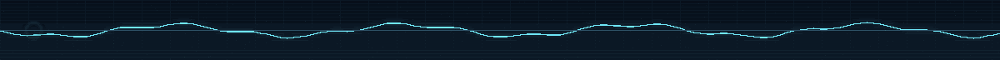
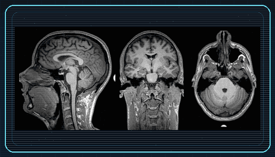
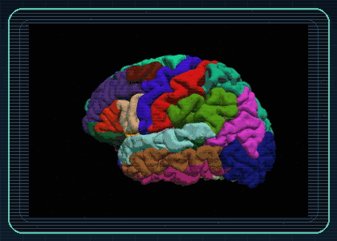

  

  <strong>Computer Vision / ML Research Engineer · Biomedical Engineer</strong> 
  Cesena, Italy · M.Sc. candidate, University of Bologna

  <a href="https://www.linkedin.com/in/davide-stefanelli-engineer/">LinkedIn</a> &nbsp; / &nbsp;
  <a href="mailto:davide.stefanelli.ing@gmail.com">Email</a> &nbsp; / &nbsp;
  <a href="#selected-projects">Explore my work ↓</a>

I build systems that turn images and neural signals into useful representations: **visual identity retrieval, EEG analysis, and medical-image processing**. My work connects model development with the tools needed to understand it—dataset curation, evaluation, failure analysis, and scientific visualization.

At **Vivilo** (formerly Jubatus), I develop visual re-identification and retrieval workflows for motorsport media, from dataset construction and PyTorch training to query–gallery evaluation and embedding post-processing.

Alongside this, I am completing an **M.Sc. in Biomedical Engineering for Neuroscience** at the University of Bologna, with graduation expected in **March 2027**. I am interested in how representation learning can generalize across subjects and make neural and biomedical data easier to interpret.

  

## Selected projects

<table>
  <tr>
    <td width="50%" valign="top">
      <h3><a href="https://github.com/DavideStefanelli97/NEURO-SCOPE">01 / NeuroScope ↗</a></h3>
      
<strong>Explore EEG in space and time.</strong>

      
A desktop app that projects channel activity onto a 3D head, with scalp heatmaps, signal inspection, topographic views, and a built-in synthetic EEG demo.

      
Python · PyQt6 · PyVista / VTK · MNE Early public release · Interactive scientific software

    </td>
    <td width="50%" valign="top">
      <h3><a href="https://github.com/DavideStefanelli97/MATLAB-EEG-Processing-Pipeline">02 / EEG Processing ↗</a></h3>
      
<strong>From raw recordings to ERP and time–frequency analysis.</strong>

      
A staged workflow for filtering, bad-channel handling, ICA artifact removal, ERP / P300 analysis, and Morlet CWT, with configuration files and diagnostic figures.

      
MATLAB · EEGLAB · ICA · ERP · CWT Signal processing · Reproducible analysis

    </td>
  </tr>
  <tr>
    <td width="50%" valign="top">
      <h3><a href="https://github.com/DavideStefanelli97/Medical-Imaging-Analysis">03 / Medical Imaging ↗</a></h3>
      
<strong>Segment anatomy. Align medical images.</strong>

      
DICOM workflows using Chan–Vese and Malladi–Sethian level sets, plus rigid registration with NCC, SSD, and mutual information. Includes visual reports for inspecting results.

      
MATLAB · DICOM · Segmentation · Registration Classical computer vision · Biomedical analysis

    </td>
    <td width="50%" valign="top">
      <h3><a href="https://github.com/DavideStefanelli97/Neural-Networks-Portfolio">04 / Neural Networks ↗</a></h3>
      
<strong>Connect neural models with learning algorithms.</strong>

      
Coursework spanning integrate-and-fire neurons, neural mass models, Hopfield networks, backpropagation, and deep learning, with repeatable runs, plots, and per-exercise reports.

      
Python · MATLAB · TensorFlow / Keras · Poetry Computational modeling · Learning experiments

    </td>
  </tr>
</table>

## From brain signals to intelligent systems

My biomedical projects span electrophysiology, anatomical imaging, and neural modeling. My next research questions center on **EEG representation learning, cross-subject generalization, and brain-inspired learning**.

I have also built an **open-set EEG identification study** using compact neural encoders and metric learning on PhysioNet EEGMMIDB, with subject-separated training and evaluation. The work connects my experience in visual retrieval with neural data; its public code release is in preparation.

  
  
   
  Structural imaging and cortical anatomy · Illustrative source animations, not project outputs · <a href="./assets/ASSET_GUIDE.md#provenance">Credits</a>

## Tools & approach

| Area | What I use |
| :--- | :--- |
| **ML & retrieval** | Python, PyTorch, metric learning, visual re-identification, mAP / CMC evaluation |
| **Signals & imaging** | MATLAB, EEGLAB, MNE-Python, NumPy, SciPy, DICOM |
| **Scientific software** | PyQt6, PyVista / VTK, Matplotlib, configuration-driven pipelines |
| **Engineering** | Git, Poetry, pytest, Ruff, documented experiments and diagnostic reports |

I care about clear evaluation protocols, inspectable failures, and experiments that can be rerun from configuration.

---

**Let's build something worth investigating.** 
Open to **Research Engineer / AI / Computer Vision roles**, research collaborations, and **PhD opportunities in Europe** at the intersection of machine learning, neuroscience, and biomedical engineering.

[Get in touch by email](mailto:davide.stefanelli.ing@gmail.com) · [Connect on LinkedIn](https://www.linkedin.com/in/davide-stefanelli-engineer/)
