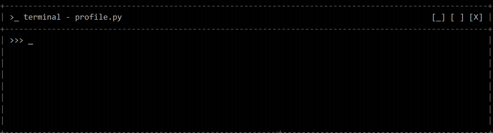
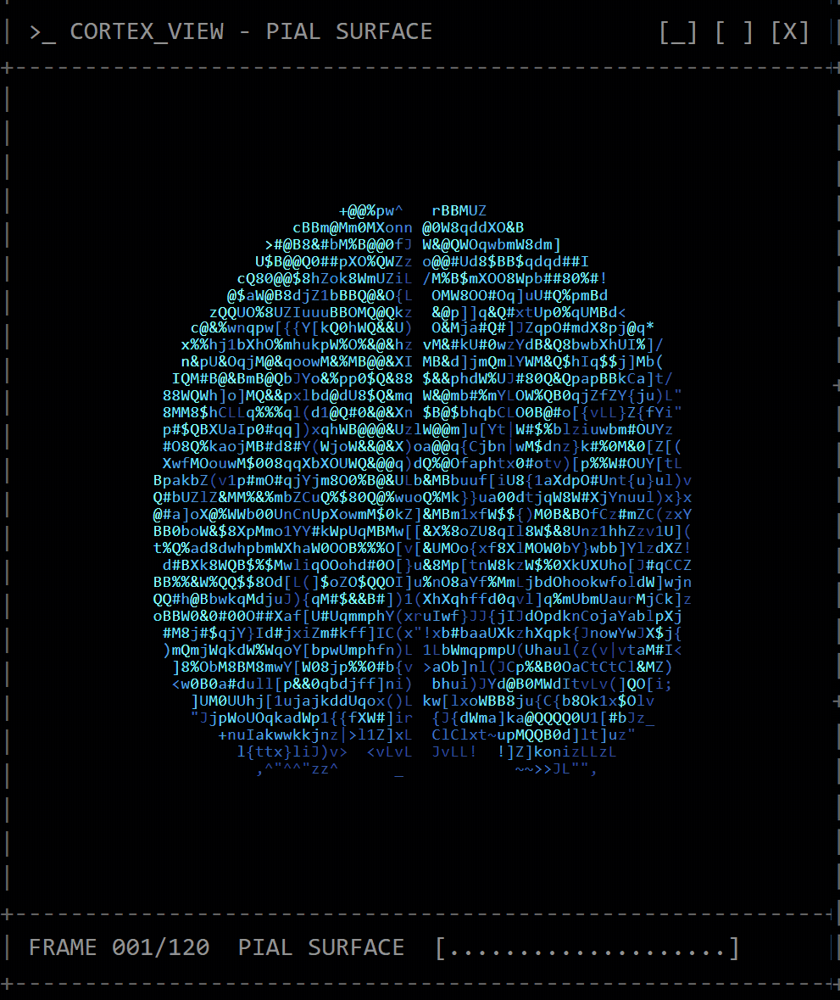
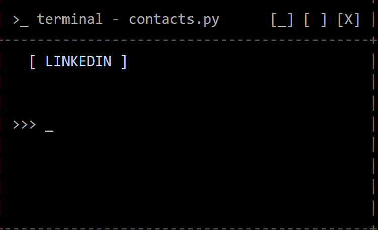
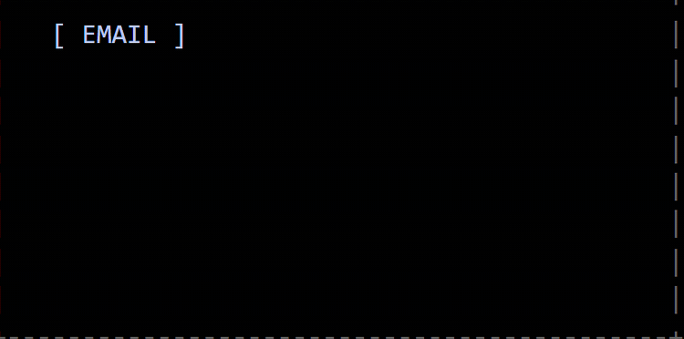
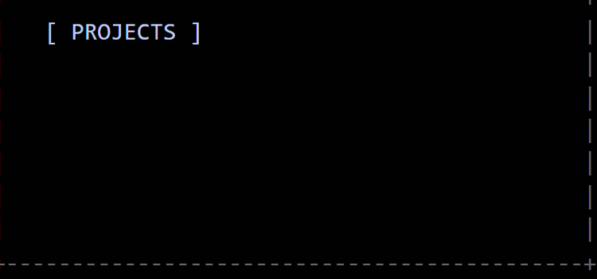

  

 

## Tools & approach

| Area | What I use |
| :--- | :--- |
| **ML & retrieval** | Python, PyTorch, metric learning, visual re-identification, mAP / CMC evaluation |
| **Signals & imaging** | MATLAB, EEGLAB, MNE-Python, NumPy, SciPy, DICOM |
| **Scientific software** | PyQt6, PyVista / VTK, Matplotlib, configuration-driven pipelines |
| **Engineering** | Git, Poetry, pytest, Ruff, documented experiments and diagnostic reports |

I care about clear evaluation protocols, inspectable failures, and experiments that can be rerun from configuration.

---

**Let's build something worth investigating.** 
Open to **Research Engineer / AI / Computer Vision roles**, research collaborations, and **PhD opportunities in Europe** at the intersection of machine learning, neuroscience, and biomedical engineering.

[Get in touch by email](mailto:davide.stefanelli.ing@gmail.com) · [Connect on LinkedIn](https://www.linkedin.com/in/davide-stefanelli-engineer/)
